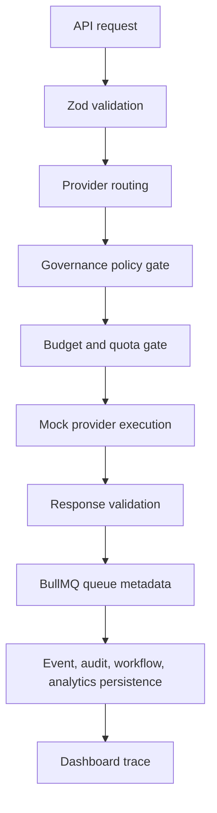

# Folqen AI Provider Gateway & Execution Runtime

## Purpose

The AI Provider Gateway is Folqen's unified execution control layer for model requests. It is designed to route future OpenRouter, Gemini, Claude, OpenAI-compatible, and local/Ollama requests through one governed runtime instead of letting departments call providers directly.

This slice is mock-safe only. It adds typed infrastructure, observability, queue plans, validation, and budget decisions, but it does not execute live provider calls.

## Current Safety State

- Default provider: `mock`
- Live provider execution: `Blocked`
- Paid provider execution: `Blocked`
- Provider activation: `Needs approval`
- Sandbox/dry-run: `Mock`
- Public publishing: `Blocked`
- Credentials: not read by frontend and never sent to providers in this slice

## Runtime Flow

## Provider Adapters

| Provider | Status behavior | Live execution |
| --- | --- | --- |
| Folqen Mock Runtime | `Mock` | Off |
| OpenRouter | `Not connected` or `Blocked` when key exists | Off |
| Gemini | `Not connected` or `Blocked` when key exists | Off |
| Claude | `Not connected` or `Blocked` when key exists | Off |
| OpenAI-Compatible API | `Not connected` or `Blocked` when key exists | Off |
| Local / Ollama | `Not connected` or `Configured` when endpoint exists | Off until sandbox approval |

## Core Files

- `src/lib/ai-gateway/types.ts`: provider, request, response, budget, validation, trace, dashboard contracts.
- `src/lib/ai-gateway/providers.ts`: provider registry and status-aware adapters.
- `src/lib/ai-gateway/routing.ts`: preferred provider and fallback-chain selection.
- `src/lib/ai-gateway/budget.ts`: token and INR cost estimates, thresholds, quotas.
- `src/lib/ai-gateway/validation.ts`: structured response, unsafe content, malformed output, and hallucination guard hooks.
- `src/lib/ai-gateway/flows.ts`: LangGraph dry-run execution runtime.
- `src/lib/ai-gateway/service.ts`: queue, event, audit, persistence, dashboard, retry orchestration.
- `src/lib/ai-gateway/api-handler.ts`: protected read/mutation access helpers.
- `src/app/api/ai-gateway/*`: protected runtime APIs.
- `src/components/command-center/ai-gateway-panel.tsx`: Tools page runtime monitor.

## APIs

- `GET /api/ai-gateway/overview`
- `GET /api/ai-gateway/providers`
- `POST /api/ai-gateway/execute`
- `POST /api/ai-gateway/retry`

Mutations require:

- authenticated user
- admin/operator permissions
- same-origin request
- Folqen mutation header
- rate limit pass

## Persistence

No migration was added. Existing flexible models are used:

- `WorkflowRun`: runtime request/output/log metadata.
- `AnalyticsRecord`: estimated cost and validation snapshots.
- `EventLog`: orchestration events.
- `AuditLog`: governance/runtime audit trail.

If the database is unavailable or a table is missing, the runtime keeps mock results in memory and reports persistence as `false`.

## Queue Integration

Added queues:

- `folqen.ai.runtime`
- `folqen.ai.retry`

Redis/BullMQ are still optional. When live queue mode is not enabled, queue operations return mock job IDs.

## Future Live-Execution Requirements

A future live provider adapter must verify all of these immediately before execution:

1. Provider credentials exist in a server-only secret source.
2. `ALLOW_PAID_TOOLS=true` when provider use may spend money.
3. Human approval status is `approved`.
4. Governance policy returns an allowed decision for the exact request.
5. Budget estimate is within monthly and department limits.
6. Rate/concurrency limits permit the request.
7. Response validation and audit logging are enabled.
8. Fallback routing cannot bypass approval or budget checks.

No future provider should be called directly from a department service.

## Controlled Activation Extension

The controlled activation layer now lives in `src/lib/live-execution/*` and is documented in `docs/CONTROLLED_LIVE_EXECUTION_ARCHITECTURE.md`.

The AI gateway remains the provider abstraction and validation layer, while live activation is responsible for:

- stage gates
- approval verification
- provider enable/disable state
- kill switch and emergency stop
- quotas and budget ceilings
- rollback/quarantine controls
- limiting Stage 1 to Gemini plus approved Research and Content Department structured workflows

Departments still must not call provider adapters directly.

## First Live Execution Slice

The first live provider capability is intentionally outside the generic dry-run gateway endpoint:

- Endpoint: `POST /api/live-execution/research/ideation`
- Provider: Gemini only
- Department: Research only
- Workflow: content ideation / trend insight only
- Output: structured JSON validated by Folqen
- Retries: disabled, one queue attempt only
- Fallback routing: disabled
- Publishing/rendering/platform/self-improvement actions: blocked

The generic `/api/ai-gateway/*` endpoints remain mock-safe. Gemini live calls are reachable only through the controlled activation layer after persisted activation, verified approval, server-side credential, budget, quota, kill-switch, and governance checks pass.

The Research Department expansion adds `POST /api/live-execution/research/workflows` for approved trend analysis, competitor insight, topic intelligence, audience insight, strategic recommendation, research reflection, memory-aware retrieval, and research scoring. This still uses Gemini only, Research only, structured JSON only, one queue attempt, no fallbacks, no publishing, no media generation, no platform APIs, and no workflow mutation.

The Content Department expansion adds `POST /api/live-execution/content/workflows` for approved hook generation, script generation, caption generation, metadata optimization, thumbnail strategy, platform adaptation, content reflection, and content quality scoring. This still uses Gemini only, Content only, structured JSON only, one queue attempt, no fallbacks, no publishing, no rendering, no media generation, no platform APIs, no scheduling, and no workflow mutation.
