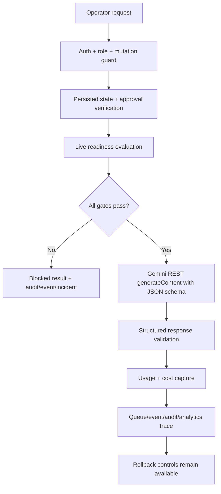

# Folqen Controlled Live Execution Activation Layer

## Purpose

This layer transitions Folqen from pure simulation toward controlled operational execution without allowing uncontrolled autonomy, uncontrolled spend, or unrestricted provider access.

The current implementation is activation-ready, not live-enabled by default. It can request activation, evaluate promotion, block or run a constrained live request, and roll back instantly. All live paths remain disabled unless every gate passes.

## First Activation Target

Only this Stage 1 target is supported:

- Provider: Gemini
- Department: Research
- Workflow: `structured_generation` / content ideation and trend insight
- Task: planning/content ideation
- Publishing: blocked
- Volume: ultra-low quota

OpenRouter, Claude, OpenAI-compatible APIs, local/Ollama, publishing workflows, media rendering, and other departments remain blocked for live execution.

## Activation Stages

| Stage | Name | Current state |
| --- | --- | --- |
| 0 | Mock only | Default |
| 1 | Single-provider limited execution | Implemented but blocked until all gates pass |
| 2 | Controlled workflow execution | Blocked |
| 3 | Department-limited activation | Blocked |
| 4 | Full governance-approved execution | Blocked |

## Mandatory Gates

Live execution is allowed only when all are true:

1. `ALLOW_LIVE_AI_EXECUTION=true`
2. `LIVE_AI_ACTIVATION_STAGE >= 1`
3. Runtime kill switch and emergency stop are off
4. Provider is Gemini
5. Department is Research
6. Workflow is `structured_generation`
7. Task type is planning
8. Server-side Gemini key exists
9. Explicit approved activation approval ID is provided
10. Sandbox promotion passed
11. Provider activation record is enabled
12. Request, daily, and monthly quotas pass
13. Budget ceilings pass
14. Governance policy does not block the request
15. Response validation runs after provider response
16. Audit/event/queue metadata are captured
17. The approval ID is verified against an actual approved `Approval` row
18. Activation state is persisted through the existing `Setting` model
19. Autonomous retries and fallback providers are disabled for the first live capability

## Runtime Flow

## Core Files

- `src/lib/live-execution/types.ts`: activation, quota, readiness, execution, dashboard contracts.
- `src/lib/live-execution/config.ts`: first live target, default quotas, env gates.
- `src/lib/live-execution/adapters.ts`: guarded Gemini REST adapter.
- `src/lib/live-execution/research-ideation.ts`: Research ideation prompt contract, JSON schema, and Zod validation.
- `src/lib/live-execution/service.ts`: activation request, promotion, live execution, emergency stop, provider actions, dashboard.
- `src/lib/live-execution/api-handler.ts`: read/operator/admin access helpers.
- `src/app/api/live-execution/*`: protected activation APIs.
- `src/components/command-center/ai-gateway-panel.tsx`: runtime activation dashboard and controls.

## APIs

- `GET /api/live-execution/overview`
- `POST /api/live-execution/activation/request`
- `POST /api/live-execution/promote`
- `POST /api/live-execution/execute`
- `POST /api/live-execution/research/ideation`
- `POST /api/live-execution/emergency-stop`
- `POST /api/live-execution/provider/action`

Admin-only:

- activation request
- sandbox promotion
- emergency stop
- provider disable/quarantine/rollback

Admin/operator:

- controlled Gemini Research ideation request, which still blocks unless all live gates pass

## First Real Gemini Capability

`POST /api/live-execution/research/ideation` is the only live-capable endpoint added for this phase. It forces:

- `providerId=gemini`
- `departmentId=research`
- `workflowKind=structured_generation`
- `taskType=planning`
- structured JSON response validation
- one BullMQ attempt only
- no fallback providers
- no publishing, rendering, platform execution, self-improvement mutation, or autonomous retry

The Gemini adapter uses the REST `generateContent` endpoint with `generationConfig.responseMimeType="application/json"` and `generationConfig.responseSchema`. The resulting JSON is parsed and validated with Zod before Folqen accepts it as a live Research ideation result.

## Persistence

No migration was added. This phase uses existing models only:

- `Setting`: persisted activation registry under `live_execution.activation.gemini_research_ideation`
- `Approval`: server-side verification of `live_execution.provider_activation` approvals
- `WorkflowRun`: live/blocked run input, output, and logs
- `AnalyticsRecord`: cost and token usage snapshots
- `ErrorLog`: blocked/failed live execution incidents
- `AuditLog` and `EventLog`: governance and operational trace

## Rollback Controls

- Emergency stop
- Provider disable
- Provider quarantine
- Rollback to Stage 0 dry-run mode
- AI retry/queue-drain metadata plan
- Runtime kill switch env flags:
  - `AI_RUNTIME_KILL_SWITCH=true`
  - `AI_RUNTIME_EMERGENCY_STOP=true`

## Budget Defaults

- Max requests per day: 5
- Max requests per month: 50
- Max concurrency: 1
- Max input tokens per request: 2000
- Max output tokens per request: 800
- Max estimated cost per request: INR 2
- Max daily cost: INR 10
- Max monthly cost: INR 200

These are intentionally below Folqen's low-cost operating budget.

## Safety Notes

- The adapter code exists, but is unreachable by default.
- Credentials are checked only on the server.
- The UI never receives secrets.
- Public publishing remains blocked.
- Paid tools remain blocked unless future settings and approval flows explicitly permit them.
- Any provider beyond Gemini requires a new reviewed slice.
