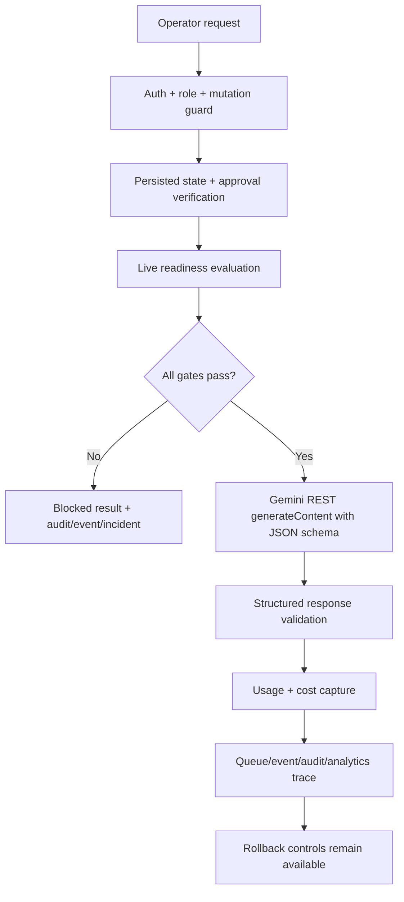

# Folqen Controlled Live Execution Activation Layer

## Purpose

This layer transitions Folqen from pure simulation toward controlled operational execution without allowing uncontrolled autonomy, uncontrolled spend, or unrestricted provider access.

The current implementation is activation-ready, not live-enabled by default. It can request activation, evaluate promotion, block or run a constrained live request, and roll back instantly. All live paths remain disabled unless every gate passes.

## First Activation Target

Only these Stage 1 targets are supported:

- Provider: Gemini
- Departments: Research, Content, and Analytics
- Workflows: `structured_generation` / approved Research, Content, and Analytics intelligence workflows
- Tasks: Research planning, Content structured output, Analytics structured output
- Publishing: blocked
- Volume: ultra-low quota

OpenRouter, Claude, OpenAI-compatible APIs, local/Ollama, publishing workflows, media rendering, platform operations, autonomous scheduling, ComfyUI/FFmpeg execution, and other departments remain blocked for live execution.

## Activation Stages

| Stage | Name | Current state |
| --- | --- | --- |
| 0 | Mock only | Default |
| 1 | Single-provider limited execution | Implemented but blocked until all gates pass |
| 2 | Controlled workflow execution | Blocked |
| 3 | Department-limited activation | Blocked |
| 4 | Full governance-approved execution | Blocked |

## Mandatory Gates

Live execution is allowed only when all are true:

1. `ALLOW_LIVE_AI_EXECUTION=true`
2. `LIVE_AI_ACTIVATION_STAGE >= 1`
3. Runtime kill switch and emergency stop are off
4. Provider is Gemini
5. Department is Research, Content, or Analytics
6. Workflow is `structured_generation`
7. Task type is approved for the department: Research planning, Content structured output, or Analytics structured output
8. Server-side Gemini key exists
9. Explicit approved activation approval ID is provided
10. Sandbox promotion passed
11. Provider activation record is enabled
12. Request, daily, and monthly quotas pass
13. Budget ceilings pass
14. Governance policy does not block the request
15. Response validation runs after provider response
16. Audit/event/queue metadata are captured
17. The approval ID is verified against an actual approved `Approval` row
18. Activation state is persisted through the existing `Setting` model
19. Autonomous retries and fallback providers are disabled for the first live capability

## Runtime Flow

## Core Files

- `src/lib/live-execution/types.ts`: activation, quota, readiness, execution, dashboard contracts.
- `src/lib/live-execution/config.ts`: first live target, default quotas, env gates.
- `src/lib/live-execution/adapters.ts`: guarded Gemini REST adapter.
- `src/lib/live-execution/research-ideation.ts`: Research ideation prompt contract, JSON schema, and Zod validation.
- `src/lib/live-execution/research-operations.ts`: approved Research workflow registry, memory-aware prompt contract, structured output schema, scoring, duplicate/safety warnings.
- `src/lib/live-execution/content-operations.ts`: approved Content workflow registry, platform-aware prompt contract, structured output schema, scoring, duplicate/safety warnings.
- `src/lib/live-execution/analytics-operations.ts`: approved Analytics workflow registry, memory-aware analytics prompt contract, structured output schema, feedback-loop scoring, duplicate/safety warnings.
- `src/lib/live-execution/service.ts`: activation request, promotion, live execution, emergency stop, provider actions, dashboard.
- `src/lib/live-execution/api-handler.ts`: read/operator/admin access helpers.
- `src/app/api/live-execution/*`: protected activation APIs.
- `src/components/command-center/ai-gateway-panel.tsx`: runtime activation dashboard and controls.
- `src/components/command-center/live-research-operations-panel.tsx`: Research Intelligence route live operations panel.
- `src/components/command-center/live-content-operations-panel.tsx`: Content Studio route live operations panel.
- `src/components/command-center/live-analytics-operations-panel.tsx`: Analytics route live operations panel.

## APIs

- `GET /api/live-execution/overview`
- `POST /api/live-execution/activation/request`
- `POST /api/live-execution/promote`
- `POST /api/live-execution/execute`
- `POST /api/live-execution/research/ideation`
- `GET /api/live-execution/research/workflows`
- `POST /api/live-execution/research/workflows`
- `GET /api/live-execution/content/workflows`
- `POST /api/live-execution/content/workflows`
- `GET /api/live-execution/analytics/workflows`
- `POST /api/live-execution/analytics/workflows`
- `POST /api/live-execution/emergency-stop`
- `POST /api/live-execution/provider/action`

Admin-only:

- activation request
- sandbox promotion
- emergency stop
- provider disable/quarantine/rollback

Admin/operator:

- controlled Gemini Research ideation, approved Research workflows, approved Content workflows, and approved Analytics workflows, which still block unless all live gates pass

## First Real Gemini Capability

`POST /api/live-execution/research/ideation` is the only live-capable endpoint added for this phase. It forces:

- `providerId=gemini`
- `departmentId=research`
- `workflowKind=structured_generation`
- `taskType=planning`
- structured JSON response validation
- one BullMQ attempt only
- no fallback providers
- no publishing, rendering, platform execution, self-improvement mutation, or autonomous retry

The Gemini adapter uses the REST `generateContent` endpoint with `generationConfig.responseMimeType="application/json"` and `generationConfig.responseSchema`. The resulting JSON is parsed and validated with Zod before Folqen accepts it as a live Research ideation result.

## Governed Research Department Expansion

The Research Department now has a second controlled endpoint:

- `GET /api/live-execution/research/workflows`
- `POST /api/live-execution/research/workflows`

It still forces Gemini + Research Department + `structured_generation` + planning only. It adds approved structured Research workflows:

- Live Trend Analysis
- Competitor Insight
- Topic Intelligence
- Audience Insight
- Strategic Recommendation
- Research Reflection
- Memory-Aware Retrieval
- Research Scoring

Every workflow uses the same activation gates as content ideation. The expansion adds memory-aware retrieval from organizational/workflow/strategic/analytics memory when available, comparison against previous live Research workflow runs, confidence/evidence/novelty/safety scoring, duplicate detection, low-quality rejection, reasoning traces, retrieval usage, token/cost capture, governance approval trace, and queue observability.

These workflows produce research intelligence only. They do not create scripts, media prompts, thumbnails, captions, schedules, platform posts, or automation actions. They also use one queue attempt only, no fallback providers, no autonomous retries, and no workflow mutation.

## Governed Content Department Expansion

The Content Department now has a controlled endpoint:

- `GET /api/live-execution/content/workflows`
- `POST /api/live-execution/content/workflows`

It forces Gemini + Content Department + `structured_generation` + `structured_output` only. It adds approved structured Content workflows:

- Live Hook Generation
- Script Generation
- Caption Generation
- Metadata Optimization
- Thumbnail Strategy
- Platform Adaptation
- Content Reflection
- Content Quality Scoring

Every workflow uses the same activation gates as Research: persisted activation state, verified approval, server credential, sandbox promotion, budget/quota checks, governance checks, provider health, and kill-switch checks. The expansion adds memory-aware retrieval from prompt/analytics/strategic/workflow/organizational memory when available, comparison against previous live Content workflow runs, quality/originality/safety/platform-fit/evidence scoring, duplicate detection, malformed-output rejection, unsafe-content warnings, generation traces, retrieval usage, token/cost capture, governance approval trace, and queue observability.

These workflows produce draft content intelligence only. They can generate hooks, script drafts, captions, metadata suggestions, thumbnail strategy text, and platform adaptation guidance for YouTube Shorts, Instagram Reels, Threads, LinkedIn, and X/Twitter, but they do not post, schedule, render, call ComfyUI, call FFmpeg, create media files, access platform APIs, or mutate workflows. They also use one queue attempt only, no fallback providers, no autonomous retries, and no workflow mutation.

## Governed Analytics Department Expansion

The Analytics Department now has a controlled endpoint:

- `GET /api/live-execution/analytics/workflows`
- `POST /api/live-execution/analytics/workflows`

It forces Gemini + Analytics Department + `structured_generation` + `structured_output` only. It adds approved structured Analytics workflows:

- Content Performance Analysis
- Hook Performance Intelligence
- Audience Retention Analysis
- Platform Performance
- Workflow Performance Analysis
- Strategic Optimization Recommendation
- Reflection-Based Analytics
- Analytics Quality Scoring

Every workflow uses the same activation gates as Research and Content: persisted activation state, verified approval, server credential, sandbox promotion, budget/quota checks, governance checks, provider health, and kill-switch checks. The expansion adds memory-aware retrieval from analytics/workflow/strategic/organizational/prompt memory when available, comparison against previous live workflow runs, existing `AnalyticsRecord` snapshots, quality/confidence/evidence/optimization/feedback-loop scoring, duplicate detection, malformed-output rejection, low-confidence warnings, reasoning traces, retrieval usage, token/cost capture, governance approval trace, and queue observability.

These workflows produce analytics intelligence and optimization recommendations only. They can interpret mock/internal analytics signals and future connector placeholders, but they do not read live YouTube or Instagram analytics APIs, access platform accounts, publish, schedule, render, mutate prompts, mutate workflows, or execute autonomous optimization. They also use one queue attempt only, no fallback providers, no autonomous retries, and no workflow mutation.

## Persistence

No migration was added. This phase uses existing models only:

- `Setting`: persisted Gemini activation registry under `live_execution.activation.gemini_research_ideation`
- `Approval`: server-side verification of `live_execution.provider_activation` approvals
- `WorkflowRun`: live/blocked run input, output, and logs
- `AnalyticsRecord`: cost and token usage snapshots
- `ErrorLog`: blocked/failed live execution incidents
- `AuditLog` and `EventLog`: governance and operational trace

## Rollback Controls

- Emergency stop
- Provider disable
- Provider quarantine
- Rollback to Stage 0 dry-run mode
- AI retry/queue-drain metadata plan
- Runtime kill switch env flags:
  - `AI_RUNTIME_KILL_SWITCH=true`
  - `AI_RUNTIME_EMERGENCY_STOP=true`

## Budget Defaults

- Max requests per day: 5
- Max requests per month: 50
- Max concurrency: 1
- Max input tokens per request: 2000
- Max output tokens per request: 800
- Max estimated cost per request: INR 2
- Max daily cost: INR 10
- Max monthly cost: INR 200

These are intentionally below Folqen's low-cost operating budget.

## Safety Notes

- The adapter code exists, but is unreachable by default.
- Credentials are checked only on the server.
- The UI never receives secrets.
- Public publishing remains blocked.
- Paid tools remain blocked unless future settings and approval flows explicitly permit them.
- Any provider beyond Gemini requires a new reviewed slice.
